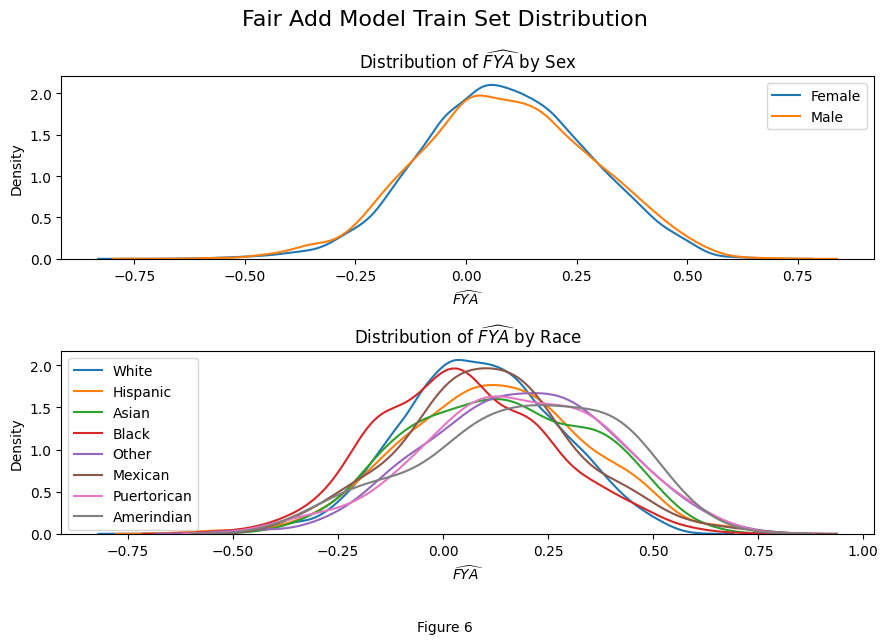

# Fair Machine Learning Using Causal Inference

This repository is a replication and exploration of the [paper](https://arxiv.org/abs/1703.06856) "Counterfactual Fairness" by Kusner et al. The original paper presents a new framework for assessing and ensuring fairness in predictive model. It does this though imposing fairness assumptions and utilizing Pearls causal modeling [framework](http://bayes.cs.ucla.edu/BOOK-2K/neuberg-review.pdf). 

## Objective
Our primary aim was to understand the concepts of counterfactual fairness and its application in predicting law school success. We demonstrated various modeling techniques to demonstrate the contrast between fair and unfair predictive models. 

## Methodology
1. Models:

   - Full Model: Includes all available attributes, including protected attributes (race and gender)
   - Unaware Model: Excludes only the protected attributes, relying on non-protected characteristics
   - Fair Models: Utilizes 1 of the 3 counterfactually fair assumptions:   
 
     Assumptions:

     1. Utilize observable features that are non-descendants of the protected attributes

     2. Introduce latent variables which are not descendants of the protected attributes

     3. Develop an additive error model

2. Data Source: 

   We used a [dataset](https://www.kaggle.com/datasets/danofer/law-school-admissions-bar-passage/data) from the LSAC National Longitudinal Bar Passage [Study](https://archive.lawschooltransparency.com/reform/projects/investigations/2015/documents/NLBPS.pdf), which includes demographic and academic information from 21,790 law students across 163 law schools in the USA. 

3. Evaluation Metrics:
  
   Following the original paper, we utilized RMSE as our objective function and then analyzed the distributions of the predicted FYA in counterfactual scenarios to evaluate fairness

## Results

Our replication was able to successfully reproduce the original papers RMSE scores for each of the models. Together, the results displayed a trade-off between fairness and accuracy. The full model, while potentially mode accurate, would raise ethical concerns due to incorporating protected attributes. The Fair models on the other hand offer more fairness at the cost of accuracy. 

|               | Full     | Unaware  | Fair K   | Fair Add |
| ------------- | -------- | -------- | -------- | -------- |
| Original Paper| 0.873    | 0.894    | 0.929    | 0.918    |
| Our Replicate | 0.872599 | 0.895767 | 0.936370 | 0.918152 |

Below is a comparisons of each protected attribute distribution of the predicted FYA for the Fair Add model. 

## Repository Structure
- `scripts/Fair-ML.ipynb`: Jupyter notebook containing all the code used for the replication study, model development, and analysis.
- `scripts/utils.py`: Utility script used in the Jupyter notebook for various functions and model implementations.
- `scripts/{gen_K_.py, fair_k_.sh}`: Py and sbatch files to run importance sampling methods. Sampling took a considerable amount of time (> 45 hours) and as such was therefore batched. 
- `models/`: Saved torch model that can be loaded in using `load_state_dict`
- `data/`: Original base study dataset and generated Knowledge samples for various methods. 